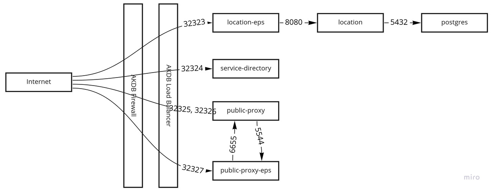

# Iris gateway helm chart

## Component overview


## Environments
There are 2 supported environments: `test` & `production`.

Domain | LB IP
---|---
test.iris-gateway.de | 193.28.249.45
prod.iris-gateway.de | 193.28.249.53

## Prepare a cluster for deployments
1. create project `iris`
1. create namespace `iris-gateway` in that project
1. create service account `namespace-admin` in `iris-gateway`
1. create RoleBinding
    ```yaml
    apiVersion: rbac.authorization.k8s.io/v1
    kind: RoleBinding
    metadata:
      name: namespace-admin
      namespace: iris-gateway
    roleRef:
      apiGroup: rbac.authorization.k8s.io
      kind: ClusterRole
      name: admin
    subjects:
    - kind: ServiceAccount
      name: namespace-admin
      namespace: iris-gateway
    ```
1. extract token
    ```shell
    SECRET_NAME=$(kubectl -n iris-gateway get sa namespace-admin -o jsonpath='{.secrets[0].name}')
    TOKEN=$(kubectl -n iris-gateway get secret $SECRET_NAME -o json | jq -r '.data.token' | base64 -d)
    echo $TOKEN
    ```
1. add token to kubeconfig, add as secret to GitHub repo, as `KUBECONFIG`
to the specific _environment_ (`test` or `production`)
    ```yaml
    apiVersion: v1
    clusters:
      - cluster:
          insecure-skip-tls-verify: true # TODO replace with CA cert
          server: <ask operations colleagues for api server url>
        name: default
    contexts:
      - context:
          cluster: default
          user: default
        name: default
    current-context: default
    kind: Config
    preferences: {}
    users:
      - name: default
        user:
          token: <service-account-token for user namespace-admin>
    ```
1. create secret `iris-gateway-tls` manually in `iris-gateway`
    ```yaml
    apiVersion: v1
    kind: Secret
    type: Opaque
    metadata:
      name: iris-gateway-tls
      namespace: iris-gateway
    data:
      ls-1.crt: ...  # b64 encoded
      ls-1.key: ...  # b64 encoded
      public-proxy-1.crt: ...  # b64 encoded
      public-proxy-1.key: ...  # b64 encoded
      root.crt: ...  # b64 encoded
      sd-1.crt: ...  # b64 encoded
      sd-1.key: ...  # b64 encoded
      dtrust-test-root.crt: ... #b64 encoded (only at test)
    ```
